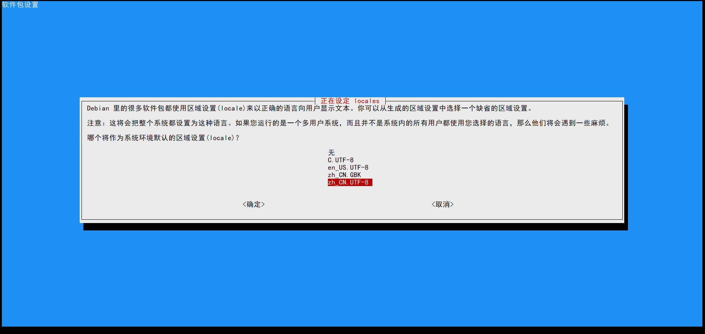
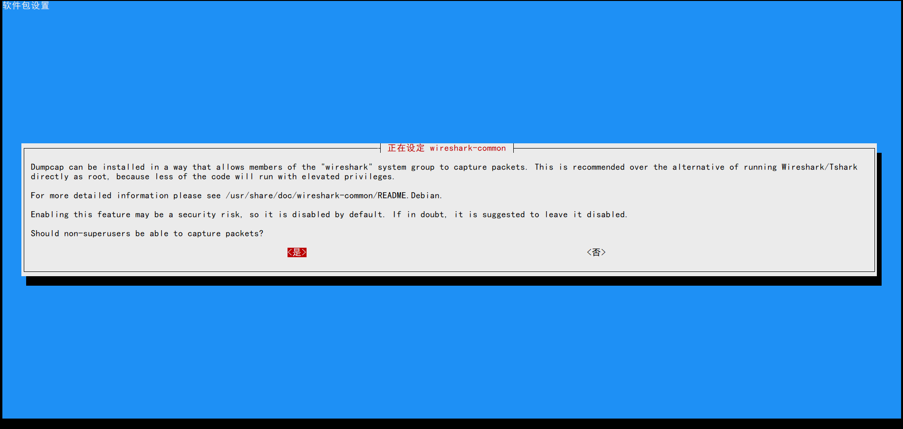

### 优化kali-xfce-vnc-all:0.1

# 安装中文字体

root@d9cad124bc0d:/# apt-get -y install ttf-wqy-zenhei

root@d9cad124bc0d:/# sudo dpkg-reconfigure locales

把下面的三个选择上（按空格键选择）

en_US.UTF-8、zh_CN.GBK、zh_CN.UTF-8

table 键选择ok然后选择zh_CN.UTF-8

# 默认安装wireshark软件可能会有问题

## 安装wireshark-gtk

root@d9cad124bc0d:/# apt-get -y remove wireshark

root@d9cad124bc0d:/# apt-get -y install wireshark-gtk

root@d9cad124bc0d:/# sudo dpkg-reconfigure wireshark-common  

选择“是”

root@d9cad124bc0d:/# sudo gpasswd -a $USER wireshark

root@d9cad124bc0d:/# sed -i 's/dofile(DATA_DIR.."console.lua")/--dofile(DATA_DIR.."console.lua")/g' /usr/share/wireshark/init.lua

# 保存优化好的镜像

docker commit 镜像ID  kali-xfce-vnc-all:0.2

## 需要在Dockerfile文件中定义环境变量重新build

docker build -t kali-xfce-vnc-all:0.3 .
